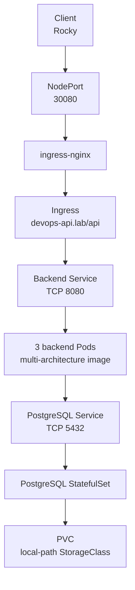

# devops-api-stack on Kubernetes

This directory contains the integrated Kubernetes deployment of the
`devops-api-stack`.

Unlike the other directories under `kubernetes/`, which contain isolated
learning exercises, this package combines the concepts studied during the CKA
phase into a complete application deployment.

## Architecture



## Components

| Component | Kubernetes resource | Purpose |
|---|---|---|
| Application namespace | Namespace | Isolates the application resources |
| Application configuration | ConfigMap | Stores non-sensitive application settings |
| Database credentials | Secret | Stores the PostgreSQL username and password outside Git |
| Backend | Deployment | Runs three replicas of the Python API in the lab overlay |
| Backend networking | ClusterIP Service | Provides a stable endpoint for the backend Pods |
| Database | StatefulSet | Runs PostgreSQL with persistent storage |
| Database networking | ClusterIP and headless Services | Provides application access and stable StatefulSet identity |
| Storage | PVC and local-path StorageClass | Dynamically provisions persistent database storage |
| External routing | Ingress | Routes `/api` requests for `devops-api.lab` |
| Cluster entry point | ingress-nginx NodePort | Exposes HTTP on port `30080` |
| Network security | NetworkPolicy | Restricts communication between components |
| GitOps deployment | Argo CD Application | Keeps the cluster aligned with the `master` branch |

## Tested environment

The deployment is tested on a mixed-architecture kubeadm cluster:

| Node | Architecture | Role |
|---|---|---|
| Ubuntu control plane | AMD64 | Kubernetes control plane |
| Raspberry Pi worker | ARM64 | Application workloads |

The backend image is published to GitHub Container Registry with support for:

- `linux/amd64`
- `linux/arm64`

## Prerequisites

The following components must be available before deploying the application:

- Kubernetes 1.35 or compatible;
- `kubectl` with Kustomize support;
- Helm;
- a CNI that enforces Kubernetes NetworkPolicy, in this case Calico;
- Rancher Local Path Provisioner;
- ingress-nginx;
- Argo CD.

Verify the cluster components:

```bash
kubectl get nodes

kubectl -n kube-system get \
  daemonset/calico-node \
  deployment/calico-kube-controllers

kubectl -n local-path-storage get \
  deployment/local-path-provisioner
```

## Install the StorageClass

The application expects a StorageClass named `local-path` using the existing
Local Path Provisioner:

```bash
kubectl apply \
  -f prerequisites/local-path-storageclass.yaml

kubectl get storageclass local-path
```

If the provisioner is not installed, the PostgreSQL PVC will remain
`Pending`.

## Install ingress-nginx

Add the official Helm repository:

```bash
helm repo add ingress-nginx \
  https://kubernetes.github.io/ingress-nginx

helm repo update
```

Install the pinned chart version with the project values:

```bash
helm upgrade --install ingress-nginx \
  ingress-nginx/ingress-nginx \
  -n ingress-nginx \
  --create-namespace \
  --version 4.15.1 \
  --values prerequisites/ingress-nginx-values.yaml
```

The controller is exposed using:

- HTTP NodePort: `30080`
- HTTPS NodePort: `30443`

The application currently uses HTTP only. Port `30443` is reserved for a
future TLS configuration.

## Configure the PostgreSQL credentials

Create the local secret source from the provided example:

```bash
cp \
  overlays/lab/secrets.env.example \
  overlays/lab/secrets.env

chmod 600 overlays/lab/secrets.env
```

Edit the file and replace the example password:

```dotenv
DB_USER=devops_api
DB_PASS=replace-with-a-strong-password
```

The file is ignored by Git and must never be committed. Create the namespace
and the Secret directly in the cluster:

```bash
kubectl create namespace devops-api \
  --dry-run=client \
  -o yaml | kubectl apply -f -

kubectl -n devops-api create secret generic postgres-credentials \
  --from-env-file=overlays/lab/secrets.env \
  --dry-run=client \
  -o yaml | kubectl apply -f -
```

The Secret keeps the stable name `postgres-credentials`. It is required by the
backend and PostgreSQL, but it is not managed by Git or Argo CD.

## Validate the manifests

Render the manifests before applying them:

```bash
kubectl kustomize overlays/lab
```

Perform server-side validation:

```bash
kubectl apply -k overlays/lab --dry-run=server
```

## Deploy with Argo CD

GitHub Actions and Argo CD have different responsibilities:

- GitHub Actions validates the project and publishes container images;
- Argo CD deploys the manifests and reconciles the cluster state.

The Argo CD Application follows:

- branch: `master`;
- path: `kubernetes/devops-api-stack/overlays/lab`.

Automatic sync, pruning and self-healing are enabled. After a change is merged
into `master`, Argo CD detects it and applies the new desired state.

Bootstrap the AppProject and Application once:

```bash
kubectl apply -k argocd

kubectl -n argocd get \
  appproject/devops-api-stack \
  application/devops-api-stack
```

Follow the first reconciliation:

```bash
kubectl -n argocd get \
  application/devops-api-stack \
  -w
```

When the Application reports `Synced` and `Healthy`, confirm the workloads:

```bash
kubectl -n devops-api rollout status \
  statefulset/postgres

kubectl -n devops-api rollout status \
  deployment/backend
```

## Verify the deployment

```bash
kubectl -n devops-api get \
  deployment,statefulset,pod,service,pvc,ingress,networkpolicy \
  -o wide
```

Expected state:

- PostgreSQL StatefulSet: `1/1`;
- backend Deployment: `3/3`;
- PostgreSQL PVC: `Bound`;
- Ingress host: `devops-api.lab`;
- backend and PostgreSQL Pods: no unexpected restarts.

## Access the API

The simplest test does not require local DNS configuration:

```bash
curl \
  -H 'Host: devops-api.lab' \
  http://192.168.1.163:30080/api/live
```

To use the hostname directly, add the worker address to the client hosts file:

```text
192.168.1.163 devops-api.lab
```

The API is then available at:

```text
http://devops-api.lab:30080/api
```

## Endpoints

| Endpoint | Purpose |
|---|---|
| `/api/live` | Confirms that the backend process is alive |
| `/api/ready` | Confirms that the backend can reach PostgreSQL |
| `/api/health` | Reports database connectivity |
| `/api/version` | Returns the application version |
| `/api/visits` | Increments and returns the persistent visit counter |
| `/api/reset` | Resets the visit counter |
| `/api/whoami` | Returns the responding backend Pod identity |
| `/api/metrics` | Returns application request and uptime metrics |
| `/api/help` | Lists the available operations |

Examples:

```bash
curl http://devops-api.lab:30080/api/live
curl http://devops-api.lab:30080/api/ready
curl http://devops-api.lab:30080/api/visits
curl http://devops-api.lab:30080/api/whoami
```

## Health probes

The backend exposes internal probe endpoints without the public `/api`
prefix:

| Probe | Path | Purpose |
|---|---|---|
| Startup | `/live` | Allows the application time to initialise |
| Readiness | `/ready` | Removes Pods from the Service when PostgreSQL is unavailable |
| Liveness | `/live` | Restarts an unresponsive backend process |

The Ingress only exposes `/api`, so the internal probe paths are not publicly
routed.

PostgreSQL uses `pg_isready` for startup, readiness and liveness checks.

## Persistent storage

PostgreSQL runs as a StatefulSet and uses a dynamically provisioned PVC:

```text
data-postgres-0
```

The `local-path` StorageClass uses:

```yaml
volumeBindingMode: WaitForFirstConsumer
reclaimPolicy: Delete
```

`WaitForFirstConsumer` allows Kubernetes to provision the volume on the node
selected for the PostgreSQL Pod.

## Network security

The package applies three NetworkPolicies.

### PostgreSQL ingress

Only backend Pods may connect to PostgreSQL on TCP port `5432`.

### Backend ingress

Only the ingress-nginx controller may connect to backend Pods on TCP port
`8080`.

### Backend egress

Backend Pods may connect only to:

- PostgreSQL on TCP port `5432`;
- CoreDNS on UDP/TCP port `53`.

## Container security

The backend container:

- runs as UID/GID `10001`;
- runs as a non-root user;
- uses a read-only root filesystem;
- disables privilege escalation;
- does not mount a Kubernetes ServiceAccount token;
- drops all Linux capabilities;
- uses the runtime-default seccomp profile.

PostgreSQL:

- runs as UID/GID `999`;
- uses an `fsGroup` for persistent volume ownership;
- disables privilege escalation;
- drops all Linux capabilities;
- uses the runtime-default seccomp profile.

## Image updates

The lab overlay pins the backend to a commit-specific image tag.

To deploy another validated build:

1. Confirm that the image supports both AMD64 and ARM64:

   ```bash
   docker buildx imagetools inspect \
     ghcr.io/limonne/devops-api-stack:sha-COMMIT
   ```

2. Update `newTag` in `overlays/lab/kustomization.yaml` on a feature branch.

3. Commit the change, push the branch and merge the pull request after CI
   succeeds.

4. Argo CD detects the change in `master` and performs the rollout.

## Continuous integration

GitHub Actions validates:

- Python syntax and lint;
- Docker Compose configuration;
- Docker image build;
- Docker Compose health checks;
- YAML files in this package;
- Kustomize rendering for the base and lab overlay;
- secret-file hygiene;
- multi-architecture image publication to GHCR when image-related files
  change.

The workflow also confirms that `secrets.env` is not tracked. Real credentials
are never uploaded to GitHub.

GitHub Actions does not deploy the application. Deployment is handled by Argo
CD after the validated change reaches `master`.

## Troubleshooting

### PostgreSQL PVC remains Pending

Check the StorageClass and provisioner:

```bash
kubectl get storageclass local-path

kubectl -n local-path-storage get deployment/local-path-provisioner

kubectl -n devops-api describe pvc/data-postgres-0
```

### Backend is not Ready

Check the backend logs and PostgreSQL connectivity:

```bash
kubectl -n devops-api logs deployment/backend

kubectl -n devops-api get pod postgres-0
```

### Ingress returns 404

Confirm that the correct host and `/api` prefix are being used:

```bash
curl -H 'Host: devops-api.lab' \
  http://192.168.1.163:30080/api/live
```

Inspect the Ingress:

```bash
kubectl -n devops-api describe ingress devops-api
```

### DNS resolution fails after applying NetworkPolicy

Confirm that CoreDNS is running and that `allow-backend-egress` exists:

```bash
kubectl -n kube-system get pods -l k8s-app=kube-dns

kubectl -n devops-api get networkpolicy/allow-backend-egress
```

### Argo CD does not report Synced

Inspect the Application conditions and the repo-server logs:

```bash
kubectl -n argocd get \
  application/devops-api-stack \
  -o yaml

kubectl -n argocd logs \
  deployment/argocd-repo-server \
  --tail=50
```

Also confirm that `postgres-credentials` exists before expecting the workloads
to become Ready:

```bash
kubectl -n devops-api get secret/postgres-credentials
```

## Removal

Delete the Argo CD Application first so it does not recreate resources while
they are being removed:

```bash
kubectl -n argocd delete \
  application/devops-api-stack

kubectl -n argocd delete \
  appproject/devops-api-stack

kubectl delete namespace devops-api
```

> **Warning:** deleting the Namespace also deletes the PVC and
> dynamically provisioned PostgreSQL volume. The stored database data may be
> permanently lost.

Cluster-level prerequisites are managed separately. Remove ingress-nginx only
when it is no longer used by other applications:

```bash
helm uninstall ingress-nginx -n ingress-nginx
```

## Current limitations

This project aims to be a realistic laboratory deployment, not a production
database platform.

Current limitations are deliberate:

- one PostgreSQL replica without high availability;
- node-local persistent storage;
- HTTP without TLS;
- NodePort instead of a cloud load balancer;
- PostgreSQL credentials created manually in the cluster;
- no automated database backup;
- no external Secret management.

These areas will evolve during the observability and AWS phases.
